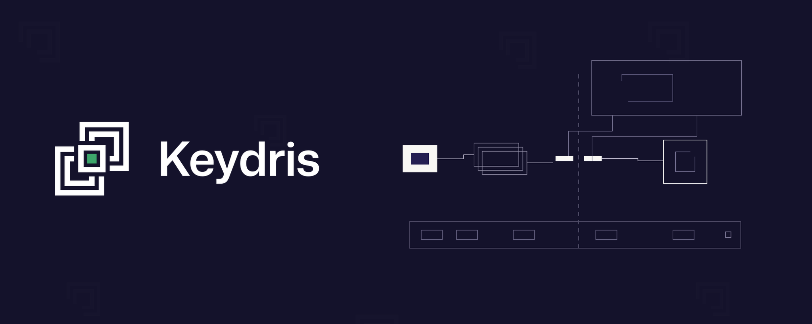

# keydris-cli: Secretless, Per-Session Egress for Unmodified Agents

**`keydris` is the command-line client that gives a coding agent a fresh cryptographic identity per session and routes its egress through a local proxy. The agent holds no API key, no PAT, no secret of any kind: for every origin its policy governs, the control plane authorizes the call and either executes it upstream itself or injects the credential on the wire. Claude Code and OpenAI Codex run unmodified.**

[](https://www.apache.org/licenses/LICENSE-2.0)
[](https://github.com/keydrisLabs/keydris-cli/actions/workflows/release.yml)
[](https://www.npmjs.com/package/@keydris/cli)


[](https://discord.gg/3JUcXkUTu)

---

<p align="center">
  
</p>

<p align="center">
  An agent that holds no credential of its own. One session, one identity, one authorized call at a time.
</p>

<p align="center">
  <a href="https://keydris.com/">Website</a> ·
  <a href="ARCHITECTURE.md">Architecture</a> ·
  <a href="https://discord.gg/3JUcXkUTu">Discord</a>
</p>

---

## Documentation

**[ARCHITECTURE.md](ARCHITECTURE.md)** is the design and operational reference: the trust model, the session lifecycle, every wire message, how a request is matched to a route, all three enforcement modes, the complete decision table, what the proxy does and does not terminate, and the seams to extend it through.

Focused guides live in [`docs/`](docs/): [sandbox](docs/sandbox.md) · [attribution](docs/attribution.md) · [codex](docs/codex.md) · [releasing](docs/releasing.md) · [npm distribution](docs/npm-distribution.md).

---

## Why a secretless agent CLI?

An agent that talks to GitHub, Slack, or an MCP server normally holds that service's credential. It sits in the environment, in `~/.netrc`, in a config file, or in the harness's own secret store — usable by every tool call, every subprocess, and anyone who gets a shell on the machine.

`keydris` removes that credential from the agent's machine entirely.

- **No secret at rest on the agent side.** A compromised laptop yields nothing between requests; an attacker has to be present *during* an authorized call, on an origin the policy already governs.
- **The credential's blast radius is one call.** Not one process, not one session: one HTTP request or one `tools/call`, with its real arguments, evaluated against policy before anything reaches the network.
- **Authorization is bound to the actual request.** The method, path, resource id, and body travel with the decision, so the control plane decides against the call that is really about to happen — and re-enforces that decision server-side at execution time.
- **The agent is unmodified.** Claude Code runs `claude`; Codex runs through `keydris codex`. Neither knows Keydris exists beyond the hooks `keydris init` wires up.
- **Failures deny.** No session, control plane unreachable, request timeout, malformed payload: every error path is an explicit deny, never a silent allow.
- **One static binary, one Go dependency.** `CGO_ENABLED=0`, stdlib plus a JSON canonicalizer. No runtime, no daemon manager, no kernel module required on the default plane.

---

## The flow

```text
keydris init  ──► POST /runtime/sessions  (mTLS)      ──► short-lived KIT, revoked immediately
              ──► GET  /v1/runtime/routes (KIT)       ──► governed origins ──► managed-destinations.json

session start ──► POST /runtime/sessions  (mTLS, Idempotency-Key) ──► KIT: a SPIFFE JWT-SVID
              ──► GET  /v1/runtime/routes (KIT bearer)            ──► routes + selected resources
              ──► register(handle, KIT, routes)                   ──► the keydris daemon, over its local socket

agent egress  ──► keydris proxy :15001
                  │
                  ├─ origin not governed ──────► opaque CONNECT tunnel ──► upstream, untouched
                  │
                  └─ origin governed ──► terminate TLS (Keydris CA) ──► match one route
                       │
                       ├─ provider_executor ─► POST /v1/runtime/providers/<provider>/execute ─► upstream response relayed back
                       ├─ mcp_gateway       ─► POST /v1/runtime/mcp/gateway                  ─► JSON-RPC response relayed back
                       ├─ mcp_kit_reader    ─► POST /v1/runtime/mcp/kit-action-tokens        ─► token injected, request forwarded
                       └─ no route          ─► POST /agent/authorize (legacy broker)         ─► credential injected on the wire

shell command ──► PreToolUse hook ──► POST /v1/runtime/commands/authorize (KIT) ──► allow | ask | deny
```

The CLI owns exactly four moments.

| Stage | Where | What it does |
| --- | --- | --- |
| **Bind** | [`hook.go`](internal/cli/hook.go) | Mint a runtime session, fetch its routes, register both with the daemon |
| **Intercept** | [`sandboxproxy.go`](internal/node/dataplane/sandboxproxy.go) | Terminate TLS on governed origins only; attribute the connection to a session |
| **Decide** | [`runtime_router.go`](internal/node/daemon/runtime_router.go) | Match one request to one route, then take that route's enforcement path |
| **Gate** | [`pretool.go`](internal/cli/pretool.go) | Send each shell command to the policy before the harness is allowed to run it |

Everything else — origin canonicalization, credential injection, the evidence ledger — hangs off those four.

---

## Install

`install.sh` downloads a **prebuilt, static binary** (no Go, no checkout) and installs it to `/usr/local/bin`:

```bash
curl -fsSL https://get.keydris.com/keydris-cli/install.sh | bash      # stable
curl -fsSL https://dev.get.keydris.com/keydris-cli/install.sh | bash  # dev
```

**The URL is the channel.** Each host serves only its own and returns 403 for the other, so there is no channel variable to pass and no way to pull a dev build from the stable host. Both channels drop a `~/.keydris.toml` pointing at that channel's control plane and IdP — an install works with **no environment variables set** — and record the channel so `keydris upgrade` stays on it.

| Installer variable | Default | Meaning |
| --- | --- | --- |
| `PREFIX` | `/usr/local` | Install prefix; the binary lands at `$PREFIX/bin/keydris` |
| `KEYDRIS_VERSION` | `latest` | Pin a specific published version |
| `KEYDRIS_BASE_URL` | the installer's channel host | Mirror or local testing |
| `KEYDRIS_NO_CONFIG` | unset | `1` keeps an existing `~/.keydris.toml` |

The installer verifies the download against `SHA256SUMS` before installing. `keydris version` reports the build.

### npm

```bash
npm install --global @keydris/cli
keydris init
```

The launcher selects a prebuilt native binary for Windows, macOS, or Linux; it does not reimplement the security-sensitive Go runtime in JavaScript. Its config-only postinstall step writes the bundled channel defaults to `~/.keydris.toml`, backing up an existing file as `~/.keydris.toml.bak`; set `KEYDRIS_NO_CONFIG=1` to skip it. A global installation is recommended, because npm owns the executable location the background proxy runs from. See [docs/npm-distribution.md](docs/npm-distribution.md).

### From source

```bash
make install                 # build + install to /usr/local/bin  (PREFIX=$HOME/.local make install)
make build && ./bin/keydris status
go install github.com/keydrisLabs/keydris-cli/cmd/keydris@latest   # once the module is reachable
```

On Windows, build natively:

```powershell
go build -o bin\keydris.exe .\cmd\keydris
```

---

## Getting Started

### Prerequisites

- **A reachable Keydris control plane.** The CLI is the agent/client half; the issuer, broker, and grant store are a separate service it reaches over mTLS. See [Pointing at a control plane](#pointing-at-a-control-plane).
- **An agent id** — a UUID an operator creates for this integration in the Keydris console, where the governing policy is assigned. The CLI never selects or overrides a policy.
- Claude Code, or the OpenAI Codex CLI, or neither (`keydris run` works standalone).

### Quickstart — Claude Code

```bash
# 1. Configure Claude Code's sandbox: generate the Keydris CA and write the
#    sandbox block, the CA environment, and the SessionStart/SessionEnd/PreToolUse
#    hooks into ~/.claude/settings.json. If no identity is bound to this agent
#    yet, init finishes with a browser sign-in that binds this device to it. It
#    then reads the origins this agent's policy governs and prints them — there
#    is no scope to configure by hand.
keydris init claude-code <agent-id>   # add --trust-store to install the CA system-wide

# 2. Start the brokered egress proxy in the background (no `&` needed).
keydris proxy up

# 3. Confirm enforcement state and the detected proxy scope.
keydris status

# 4. Run a real session. Claude Code fires the wired SessionStart hook, which
#    mints a runtime session and registers it; the proxy attributes the session's
#    egress to that identity, and every Bash command is checked against the
#    policy's command rules first.
claude
```

`keydris init` with no arguments opens an interactive menu that prompts for the same two choices. `keydris login` also works standalone (to re-authenticate); `init` runs it automatically when needed.

### Quickstart — OpenAI Codex

Codex does not currently expose a reliable end-of-session hook, so Keydris owns the lifecycle by wrapping the process:

```bash
keydris init codex <agent-id>        # `init openai` is also accepted
keydris proxy up
keydris codex                        # normal Codex arguments follow
```

Run `/hooks` once inside Codex to trust the new entries, and pair the integration with `approval_policy = "untrusted"` (see [`examples/codex/config.toml`](examples/codex/config.toml)). Launch through `keydris codex`, never `codex` directly, when governance is required. Details: [docs/codex.md](docs/codex.md).

### Without a harness

`keydris run` plays the sandbox's role, exercising the same proxy and enforcement path:

```bash
keydris run -- curl -s https://your-api/
```

To cover Claude Code's own remote-HTTP MCP client (not only its sandboxed Bash children), launch the process itself through the proxy:

```bash
keydris run -- claude
```

---

## Runtime enforcement

At session start the CLI mints a **runtime session** over mTLS (`POST /runtime/sessions`, with an `Idempotency-Key`) and receives a **KIT** — a short-lived SPIFFE JWT-SVID bearer token. It then fetches the session's **routes** (`GET /v1/runtime/routes`, KIT bearer): the origins the agent's policy governs, each tagged with an enforcement mode and the specific resources (repos, channels, tools) selected for that agent, addressed by stable routing keys. The daemon registers the session — KIT and routes included — over its authenticated local socket, and every proxied request is matched against those routes before anything reaches the network.

| Enforcement mode | What happens |
| --- | --- |
| `provider_executor` | The request is relayed to `POST /v1/runtime/providers/<provider>/execute` with the stable resource id resolved from the request itself — GitHub: `owner/repo` from the path → `github.full_name` (case-insensitive); Slack: the body's `channel` → `slack.channel_id`. The control plane authorizes and executes upstream with the org credential; the agent never holds it, and the upstream response is relayed back verbatim. |
| `mcp_gateway` | JSON-RPC `tools/call` and `resources/read` are relayed through `POST /v1/runtime/mcp/gateway`, which executes them and returns a JSON-RPC response bound to the original request id. |
| `mcp_kit_reader` | MCP lifecycle and discovery traffic passes through unchanged. For `tools/call` and `resources/read`, the daemon mints a short-lived, action-bound token through `POST /v1/runtime/mcp/kit-action-tokens`, injects it at `params._meta["keydris/kit_action_token"]`, and forwards the request to the managed MCP server, which redeems it for the credential. The server side of that exchange is [keydris-reader](https://github.com/keydrisLabs/keydris-reader). |
| origin governed by no route | Falls back to the legacy broker path (`POST /agent/authorize`) and the proxy-scope rules below. |

Every decision the CLI makes here is re-enforced server-side at execution time. A repeated SessionStart for the same logical session (Claude compaction or resume, a Codex retry) revokes the previous instance first; SessionEnd revokes on exit; the daemon renews a KIT before it expires without changing the attribution token.

---

## The wire contract

### Minting a session

```http
POST /runtime/sessions           (mTLS client certificate)
Idempotency-Key: cli-<32 hex>
```

```json
{ "agent_id": "<uuid>", "session_handle": "<per-session token>" }
```

```json
{
  "schema_version": 1,
  "session_id": "01JBQ8...",
  "kit": {
    "kit_format": "jwt_svid",
    "spiffe_id": "spiffe://keydris.local/agent/...",
    "token": "<JWT>",
    "expires_at": "2026-08-21T12:00:00Z"
  }
}
```

### Fetching the routes

```http
GET /v1/runtime/routes           Authorization: Bearer <KIT>
```

```json
{
  "schema_version": 1,
  "organization_id": "<uuid>",
  "agent": { "agent_id": "<uuid>", "display_name": "repo-tools" },
  "policy": { "policy_id": "<uuid>", "policy_version_id": "<uuid>", "policy_hash": "sha256:…" },
  "routes": [
    {
      "route_id": "<uuid>",
      "display_name": "GitHub",
      "provider": "github",
      "connection_id": "<uuid>",
      "enforcement_mode": "provider_executor",
      "availability": "ready",
      "status_reason_code": null,
      "matchers": [
        { "matcher_type": "http.origin",
          "attributes": { "scheme": "https", "host": "api.github.com", "port": 443, "path_prefix": "/" } }
      ],
      "resources": [
        { "resource_type": "github.repository", "resource_id": "<uuid>",
          "external_id": "acme/api", "display_name": "acme/api", "availability": "ready",
          "status_reason_code": null,
          "routing_keys": [ { "key_type": "github.full_name", "value": "acme/api" } ] }
      ],
      "runtime_endpoint_path": "/v1/runtime/providers/github/execute"
    }
  ]
}
```

There is no revision, ETag, or pagination: the CLI fetches this once per session and every invariant it reports is re-enforced server-side. The response is decoded strictly — unknown fields, duplicate JSON keys, trailing values, an unexpected `schema_version`, a malformed UUID or policy hash, a route with no origin matcher, or a duplicate `route_id` all fail closed at the boundary ([`routes.go`](internal/runtimecontract/routes.go)).

### Gating a shell command

```http
POST /v1/runtime/commands/authorize      Authorization: Bearer <KIT>
```

```json
{ "schema_version": 1, "request_id": "cli-…", "command": "git push --force",
  "cwd": "/home/you/repo", "tool_name": "Bash" }
```

The response is the frozen decision envelope: `allow`, `deny`, or `approval_required`, each valid only with its own `reason_code` set. A response whose decision and reason code disagree is rejected rather than interpreted — that is what stops backend/CLI enum drift from silently becoming a permission ([`decision.go`](internal/runtimecontract/decision.go)).

| Decision | Valid reason codes |
| --- | --- |
| `allow` | `keydris_policy_allowed`, `keydris_approval_granted` |
| `approval_required` | `keydris_approval_required` |
| `deny` | `keydris_policy_denied`, `keydris_policy_unavailable`, `keydris_invalid_request`, `keydris_identity_unavailable`, `keydris_target_unavailable`, `keydris_action_unsupported`, `keydris_manifest_stale`, `keydris_request_conflict`, `keydris_kit_action_token_invalid`, `keydris_enforcement_unavailable` |

---

## Every routing outcome, and whether the control plane is contacted

| # | Situation | Control plane called | Result |
| --- | --- | --- | --- |
| 1 | Origin outside the session's governed set | No | Opaque CONNECT tunnel: no TLS termination, no body read, no header touched |
| 2 | Governed origin, no route covers the path | No | Rejected — *runtime routes have no route for this path* |
| 3 | Two routes match one request | No | Rejected — *runtime route is ambiguous* |
| 4 | Matched route's `availability` is not `ready` | No | Rejected — *runtime route unavailable*, with the status reason when present |
| 5 | MCP lifecycle or discovery (`initialize`, `tools/list`, `ping`, …) | No | Forwarded unchanged; discovery never costs a decision |
| 6 | Body is not valid JSON, has duplicate keys, or exceeds 1 MiB | No | Rejected before any call — ambiguous input fails closed |
| 7 | Request names a resource the session did not select | No | Rejected — *… resource is not selected for this session* |
| 8 | `provider_executor` route, resource selected and ready | Yes | Control plane executes upstream; its status, headers, and body are relayed back |
| 9 | `mcp_gateway` route, `tools/call` / `resources/read` | Yes | Gateway executes; the JSON-RPC response is relayed, bound to the original id |
| 10 | `mcp_kit_reader` route, `tools/call` / `resources/read` | Yes | Action token minted, injected at `params._meta`, request forwarded to the MCP server |
| 11 | Control plane returns a denial | Yes | Rejected, carrying the decision's `reason_code` |
| 12 | Control plane unreachable, or slower than 15 s | Attempted | Rejected — *… unavailable*. Never allowed |
| 13 | Origin governed by no route at all | Yes (`/agent/authorize`) | Broker decides; on allow the real credential is injected on the wire |

Rows 1 through 7 are the reason this lives in the CLI: seven distinct ways a request is answered without spending a decision, each resolved locally, each with a sentence the agent can read. Row 12 is the one that matters most — the enforcement path has no fail-open branch.

---

## Proxy scope

Proxy scope controls which exact origins are TLS-terminated, inspected, and enforced — and **you never configure it by hand.**

`keydris init` reads the origins the agent's policy governs and persists them as the effective scope; every session start refreshes them, so a policy change lands without a re-init. Everything else uses an opaque CONNECT tunnel.

```bash
keydris proxy scope list
```

```text
mode: selected (detected from policy)
  api.github.com:443
  keydris-mcp-demo.fly.dev:443
```

Scope is deliberately **origin-only**, even though a policy route can also narrow a path prefix: the proxy must terminate TLS for the whole origin before it can see a path at all. Per-path enforcement still happens per request; scope only decides what gets inspected.

If scope was never detected (a fresh install, or an `init` that could not reach the control plane), Keydris falls back to `all` mode and manages every ungoverned destination — the backward-compatible default. Hostname scopes require the `sandbox` or `proxyenv` planes; the Linux transparent plane can safely scope only exact IP literals.

This is separate from Claude Code's `sandbox.network.allowedDomains`: that list controls where Claude *may connect*, while proxy scope controls where Keydris *governs and injects*.

---

## Command gating

A policy can also carry **command rules** — glob patterns over the full shell command line (`git push*` also matches `git push --force`) — with `allow`, `require_approval`, or `reject` effects. Each shell command is sent to `POST /v1/runtime/commands/authorize` with the session's KIT, and the decision maps to the harness's own permission verdict.

| Harness | Hooks wired by `keydris init` | Where |
| --- | --- | --- |
| **Claude Code** | `PreToolUse` → `keydris __pretool-use`, matcher `Bash` (`Bash\|PowerShell` on Windows), alongside SessionStart/SessionEnd | `~/.claude/settings.json` |
| **Codex** | `PreToolUse` → `keydris __pretool-use --codex` (deny-only) and `PermissionRequest` → `keydris __permission-request` (auto-allows policy-allowed commands, silent otherwise, so approval-required ones reach the interactive prompt) | `$CODEX_HOME/hooks.json`, default `~/.codex/hooks.json` |

The split on Codex is not stylistic: its `PreToolUse` cannot answer `ask` — that verdict is rejected at runtime, which would fail *open* — so approval decisions are routed to `PermissionRequest` and the human instead.

**Fail-closed by construction.** Both harnesses fail open when a hook crashes, times out, or prints invalid JSON, so every error path here — no active session, control plane unreachable, oversized payload, ambiguous JSON, a daemon session that does not match the hook session — emits an explicit deny and exits 0. Keep the configured hook timeout well above the 5-second authorization deadline.

Command-policy wildcards stop at shell operators and dynamic syntax, so `git status*` cannot authorize `git status && rm -rf /`. Compound syntax must be written explicitly in a matching rule. `keydris status` reports whether the hooks are wired; `keydris deinit claude-code|codex` removes them.

---

## Data planes

Three planes ship in this binary behind one interface. **`sandbox` is the default, so no configuration is needed** — override with `KEYDRIS_DATAPLANE` only for the others.

| Plane | Platform | Interception | Identity binding | Non-bypassable |
| --- | --- | --- | --- | --- |
| **`sandbox`** (default) | all | TLS-terminating forward proxy that Claude Code's sandbox routes all Bash-subprocess egress to. No root, no iptables | per-session token in `Proxy-Authorization`, plus optional peer verification | by the sandbox, not by Keydris |
| **`transparent`** | Linux + root | iptables `REDIRECT` + `SO_ORIGINAL_DST`, optionally race-free eBPF (`-tags ebpf`) | kernel-observed: `/proc` or eBPF → cgroup → session | yes |
| **`proxyenv`** | all | `HTTP_PROXY` fallback, kernel-free | per-session token | no — deliberately opt-in |

**Concurrent sessions are isolated.** Each session gets a distinct per-session token, carried in `Proxy-Authorization` via Claude Code's `$CLAUDE_ENV_FILE`, so the proxy attributes every connection to the right session and multiple sessions can share one proxy. A token that is *presented but unknown* resolves to unattributed rather than being downgraded to "the sole registered session" — that is exactly what keeps them isolated. Full analysis in [docs/attribution.md](docs/attribution.md); the sandbox integration in [docs/sandbox.md](docs/sandbox.md).

---

## What it guarantees, and what is yours to get right

### Guaranteed

- **The real credential never reaches the agent.** On governed origins it is either applied by the control plane's own executor or injected by the proxy on the wire. The agent presents only its per-session handle.
- **Only governed origins are inspected.** Everything else is an opaque tunnel — no TLS termination, no body read, no header mutation, and certificate pinning outside the scope is unaffected.
- **Discovery is free.** MCP `initialize`, `tools/list`, `ping`, and the rest pass through untouched and never consume a decision.
- **One session, one identity.** Concurrent sessions never borrow each other's identity, and a repeated SessionStart revokes the previous instance before replacing it.
- **Ambiguous input fails closed.** Duplicate JSON keys, oversized bodies, unknown response fields, and decision/reason-code mismatches are refused at the boundary rather than interpreted.
- **Every error path denies.** The command-gating hooks and the enforcement router have no fail-open branch.
- **Local decisions are advisory.** Every one of them is re-enforced server-side at execution time.
- **The evidence ledger is tamper-evident.** Each record's hash covers the previous record's, and `keydris logs` verifies the chain on read.

### Yours

- **Un-bypassability comes from the sandbox, not from Keydris.** It holds only while Claude Code's sandbox is enabled and routed here. `keydris init` locks it (`failIfUnavailable`, `allowUnsandboxedCommands: false`), and `keydris status` surfaces drift — but a user who disables the sandbox loses enforcement.
- **Launch through the wrapper.** `keydris codex`, never `codex`. Starting Codex directly creates no Keydris session at all.
- **Trust the Codex hooks once.** Codex will not run hooks from a new file until you confirm them with `/hooks`. For managed fleets, deploy the same absolute hook paths through Codex `requirements.toml` — user-level hook trust is not an administrator boundary.
- **Treat `~/.keydris-data` as sensitive.** `evidence.jsonl` and `proxy.log` record full JSON tool parameters and request bodies for managed authorization calls, which may contain application secrets. They are created `0600` under a `0700` directory; handle them accordingly.
- **The per-session proxy token is a bearer credential.** A co-resident process that reads it from the environment or `$CLAUDE_ENV_FILE` can impersonate the session until `session-end`.
- **Keep configuration trusted.** Project-local `.env` and `.keydris.toml` are ignored by default because letting a repository redirect OAuth, identity, and control-plane endpoints crosses a trust boundary. Opt in with `KEYDRIS_TRUST_PROJECT_CONFIG=1` only when you mean it.

See [SECURITY.md](SECURITY.md) for the full threat model, the known hardening gaps, and what is deliberately out of scope.

---

## Commands

Kept in sync with `usage()` in [internal/cli/cli.go](internal/cli/cli.go):

```text
keydris login                      Browser sign-in; stores a local client certificate
                                     [--email you@example.com] [--no-browser]
keydris whoami                     Show the locally stored identity
keydris logout                     Remove the locally stored identity
keydris init                       Interactive agent setup
keydris init claude-code <agent>   Configure Claude Code sandbox + CA
                                     [--strict] [--trust-store]
keydris init codex <agent>         Configure OpenAI Codex + CA
                                     [--trust-store]
keydris deinit claude-code|codex   Undo init: remove the Keydris config
keydris proxy up                   Start the brokered egress proxy in the background
keydris proxy down                 Stop the background proxy
keydris proxy scope list           Show the origins detected from the agent's policy
keydris run -- <cmd...>            Run a command inside a keydris session
keydris codex [args...]            Run OpenAI Codex inside a keydris session
keydris status                     Show config + sandbox enforcement state
keydris logs                       Print and verify the hash-chained evidence ledger
keydris upgrade                    Download & replace the binary with the latest release
                                     [--channel stable|dev] [--version <v>] [--no-config]
keydris telemetry [status|on|off]  Show or change anonymous install telemetry
keydris version                    Print the version
keydris help                       Show this help
```

`<agent>` is the agent id (a UUID) created for this integration in the Keydris console; the policy that governs it is assigned there, not on the command line.

The `__session-start`, `__session-end`, `__pretool-use`, and `__permission-request` entrypoints are internal — `keydris init` wires them into the harness's settings, and they are not meant to be run by hand.

---

## Project Structure

```
keydris-cli/
├── cmd/keydris/                        main(); everything else is internal
├── internal/
│   ├── cli/                            every user-facing command
│   │   ├── cli.go                      dispatch + usage (the source of truth for the command list)
│   │   ├── init.go / deinit.go         onboarding and teardown for Claude Code and Codex
│   │   ├── login.go                    browser sign-in (OAuth 2.0 Authorization Code + PKCE)
│   │   ├── proxy.go                    daemon lifecycle (`proxy up` / `down` / `scope list`)
│   │   ├── run.go                      session-wrapped exec: `keydris run`, `keydris codex`
│   │   ├── hook.go / session_hook.go   mint -> routes -> register -> revoke
│   │   ├── pretool.go                  command gating: PreToolUse + PermissionRequest
│   │   ├── scope.go                    policy-derived proxy scope
│   │   ├── status.go / logs.go         enforcement state; the evidence ledger
│   │   └── upgrade.go                  channel-bound self-update
│   ├── runtimecontract/                the control-plane wire contract, decoded strictly
│   │   ├── session.go, session_client.go   POST /runtime/sessions, revoke
│   │   ├── routes.go                   GET /v1/runtime/routes: origins, modes, resources
│   │   ├── provider.go                 POST /v1/runtime/providers/<provider>/execute
│   │   ├── mcp_gateway.go              POST /v1/runtime/mcp/gateway
│   │   ├── kit_action_token.go         POST /v1/runtime/mcp/kit-action-tokens (RFC 8785 hash)
│   │   └── decision.go                 the frozen decision + reason-code enum
│   ├── node/
│   │   ├── daemon/                     the long-running service
│   │   │   ├── daemon.go               build a plane, own the flow loop, audit every decision
│   │   │   ├── runtime_router.go       route matching + the three enforcement modes
│   │   │   └── session_renew.go        renew a KIT before it expires, atomically
│   │   ├── dataplane/                  interception, behind one interface
│   │   │   ├── sandboxproxy.go         the default plane: TLS-terminating forward proxy
│   │   │   ├── transparent_linux.go    iptables REDIRECT + SO_ORIGINAL_DST
│   │   │   ├── proxyenv.go             the kernel-free HTTP_PROXY fallback
│   │   │   └── toolmeta.go             request metadata + MCP `_meta` token injection
│   │   ├── proxy/                      the Keydris CA and per-host leaf minting
│   │   ├── sandbox/                    writes ~/.claude/settings.json and ~/.codex/hooks.json
│   │   ├── sessionsock/                the daemon's authenticated, owner-only local socket
│   │   ├── sessionstate/               durable per-session state, replaced atomically
│   │   ├── attest/                     session registry + peer verification
│   │   ├── login/                      client certificate: issue, store, renew
│   │   ├── netfilter/                  iptables rules (transparent plane)
│   │   └── ebpf/                       race-free attribution (Linux, `-tags ebpf`)
│   ├── config/                         layered configuration + the managed-scope file
│   ├── authz/                          the legacy /agent/authorize contract
│   ├── proxyscope/                     origin canonicalization and matching
│   └── evidence/                       the hash-chained ledger behind `keydris logs`
├── docs/                               sandbox, attribution, codex, releasing, npm-distribution
├── examples/                           ready-to-copy Claude Code and Codex configuration
├── npm/                                the @keydris/cli launcher + six native packages
├── deploy/                             per-channel keydris.toml, systemd unit
├── scripts/render-install.sh           binds install.sh to a channel at publish time
└── .github/workflows/release.yml       S3 + CloudFront + npm, all through GitHub OIDC
```

---

## Pointing at a control plane

Configure the control plane through the process environment or a trusted user-level `~/.keydris.toml` (see [.keydris.toml.example](.keydris.toml.example)). Precedence is **process environment > user config > opted-in project files > defaults**. Each TOML key maps to `KEYDRIS_<UPPER(KEY)>`.

```bash
export KEYDRIS_CONTROL_URL=https://api.keydris.com            # /identity/sign, /agent/jwks (:443)
export KEYDRIS_CONTROL_MTLS_URL=https://api.keydris.com:8443  # runtime + authorize endpoints (mTLS)
```

Both install channels write a `~/.keydris.toml` pointing at that channel's endpoints, so in the normal case there is nothing to set.

### Configuration

| Variable | TOML key | Default | Meaning |
| --- | --- | --- | --- |
| `KEYDRIS_CONTROL_URL` | `control_url` | `http://127.0.0.1:8081` | Standard-HTTPS endpoints: `/identity/sign`, `/agent/jwks` |
| `KEYDRIS_CONTROL_MTLS_URL` | `control_mtls_url` | `https://127.0.0.1:8443` | mTLS endpoints: runtime sessions, routes, executors, authorize |
| `KEYDRIS_MTLS_SERVER_CA` | `mtls_server_ca` | unset | Extra CA for the mTLS **server** cert. Leave unset in production; set only for a self-signed control plane |
| `KEYDRIS_DATAPLANE` | `dataplane` | `sandbox` | `sandbox`, `transparent` (Linux + root), or `proxyenv` |
| `KEYDRIS_PROXY_PORT` | `proxy_port` | `15001` | Proxy listen port |
| `KEYDRIS_HTTP_PROXY_PORT` | `http_proxy_port` | `KEYDRIS_PROXY_PORT` | The port the sandbox is told to route to |
| `KEYDRIS_DATA_DIR` | — | `~/.keydris-data` | Everything in the table below |
| `KEYDRIS_AGENT_ID` | — | read from the data dir | Normally set by `keydris init`, not by hand |
| `KEYDRIS_PEER_VERIFY` | — | `warn` | `off`, `warn`, or `enforce` — reject connections from outside the session's process tree |
| `KEYDRIS_ALLOW_SOLE_FALLBACK` | — | unset (off) | Attribute a *tokenless* request to the sole registered session |
| `KEYDRIS_TRUST_PROJECT_CONFIG` | — | unset | `1` opts into project-local `.env` / `.keydris.toml` |
| `KEYDRIS_MANAGED_MODE` / `_DESTINATIONS` | `managed_mode` / `managed_destinations` | derived from policy | **Escape hatch.** Setting these overrides scope detection; prefer leaving them unset |
| `KEYDRIS_CLAUDE_SETTINGS` | — | `~/.claude/settings.json` | Where the sandbox block and hooks are written |
| `KEYDRIS_CODEX_HOOKS` | — | `$CODEX_HOME/hooks.json` | Defaults to `~/.codex/hooks.json` |
| `KEYDRIS_OIDC_ISSUER` + `KEYDRIS_OAUTH_*` | `oidc_issuer`, `cognito_domain`, `oauth_*` | built-in mock IdP | Run `keydris login` against a real OIDC provider — see [.env.example](.env.example) |

### Where state lives

Everything sits under `~/.keydris-data` (`0700`); files are `0600`.

| Path | What |
| --- | --- |
| `identity/` | The locally generated private key, the signed client certificate, the pinned CA, and whoami metadata. The private key never leaves the machine |
| `ca.crt`, `ca.key` | The Keydris CA that terminates TLS for governed origins |
| `ca-bundle.crt` | Platform roots **plus** the Keydris CA — keeping the public roots is what lets opaque tunnels still verify |
| `agent-id` | The agent this install is bound to |
| `managed-destinations.json` | The policy-derived proxy scope, with its `source` |
| `sessions/<id>.json` | Durable per-session state (handle, ULID, KIT, routes, owner pid), replaced atomically |
| `registry.sock`, `session.auth` | The daemon's local socket and the per-install secret every message on it must present |
| `evidence.jsonl` | The hash-chained ledger `keydris logs` prints and verifies |
| `proxy.pid`, `proxy.log` | The background daemon's pid and log |

`keydris login` signs in through the browser (OAuth 2.0 Authorization Code + PKCE) and stores the client certificate under `identity/`. It works against the control plane's built-in mock IdP out of the box, or a real OIDC provider such as AWS Cognito.

---

## Tests and CI

```bash
make test      # go test ./...
make vet       # go vet ./...
make build     # version-stamped binary into bin/
```

| Suite | Covers |
| --- | --- |
| [`runtimecontract/*_test.go`](internal/runtimecontract/) | Strict decoding of every wire message: schema versions, duplicate keys, malformed identities, the decision/reason-code matrix |
| [`daemon/runtime_router_test.go`](internal/node/daemon/runtime_router_test.go) | Route matching, resource selection, and all three enforcement modes end to end |
| [`dataplane/sandboxproxy_test.go`](internal/node/dataplane/sandboxproxy_test.go), [`toolmeta_test.go`](internal/node/dataplane/toolmeta_test.go) | Attribution rules, CONNECT/authority agreement, MCP `_meta` injection |
| [`cli/pretool_test.go`](internal/cli/pretool_test.go), [`session_hook_test.go`](internal/cli/session_hook_test.go) | Command-gating verdicts on every failure path; session lifecycle and rollback |
| [`cli/channel_binding_test.go`](internal/cli/channel_binding_test.go) | Pins `keydris upgrade`'s channel→host map to `scripts/render-install.sh` |
| [`proxyscope/scope_test.go`](internal/proxyscope/scope_test.go), [`config/*_test.go`](internal/config/) | Origin canonicalization; layered config and the managed-scope file |
| [`evidence/ledger_test.go`](internal/evidence/ledger_test.go) | Hash-chain construction and tamper detection |

[`release.yml`](.github/workflows/release.yml) publishes on tag push `v*` → `stable` and push to `main` → `dev`. It cross-compiles darwin/linux × amd64/arm64 (`CGO_ENABLED=0`), verifies checksums, syncs to S3, invalidates CloudFront, then publishes the six native npm packages, waits for each to become visible in the registry, and publishes `@keydris/cli` last. AWS and npm both authenticate through GitHub OIDC — there is no AWS key and no npm token. Full runbook in [docs/releasing.md](docs/releasing.md).

---

## Who Is This For?

- **Platform and security teams** who need per-call authorization for agent egress instead of a long-lived credential on every developer's laptop
- **Enterprises** that need policy evaluated against the actual request, with an audit trail of what was allowed and why
- **Teams running Claude Code or Codex against real infrastructure** who want GitHub, Slack, and MCP access governed without forking the harness
- **Anyone who has ever put a PAT in an agent's environment** and wanted it back out
- **Operators of untrusted or shared machines** where a compromised session must not yield a usable credential

---

## Frequently Asked Questions

### Does the agent still need a token configured somewhere?

No, for every origin its policy governs. That is the point. The credential lives in the control plane, and each call is authorized and either executed there or injected on the wire. Origins the policy does not govern are untouched and keep whatever credentials they already had.

### Do I have to use Claude Code or Codex?

No. `keydris run -- <command>` opens a session, wires the proxy environment, and revokes on exit for any command. The harness integrations are conveniences that wire the same lifecycle into hooks.

### What happens to MCP `initialize` and `tools/list`?

They pass straight through and never reach the control plane. An agent can connect and see what is on offer; it discovers it needs authorization only when it asks for something that reveals or spends a credential.

### Why is proxy scope origin-only when my policy names a path prefix?

Because the proxy must terminate TLS for a whole origin before a path is visible to it. Scope decides what gets inspected; per-path enforcement still happens per request, inside the route matcher.

### What does the agent see when policy denies a call?

A rejection whose text names the reason — for example *GitHub request denied: keydris_policy_denied* — rather than a hang or an opaque 500. For shell commands, the harness's own permission UI shows the deny with its reason.

### Can a user just turn the sandbox off?

Yes, and that is the honest boundary. Un-bypassability comes from Claude Code's sandbox (bubblewrap on Linux/WSL2, Seatbelt on macOS), not from Keydris. `keydris init --strict` locks it as a hard gate and `keydris status` reports drift, but a user with write access to their own settings can disable it. The Linux `transparent` plane is the non-bypassable option today.

### Does Keydris see my decrypted traffic?

On governed origins, yes — it has to, in order to be the enforcement point. TLS termination there is sanctioned through the custom-proxy + CA-in-sandbox path, so pinning is a non-issue inside the sandbox. Everything outside the scope stays an opaque tunnel that Keydris cannot read.

### Does this govern what the control plane does after it gets the request?

No, and that is by design. The CLI governs *which requests reach an upstream and with what authority*. What the control plane's executor does with the org credential is its own trust boundary.

### Can I use it commercially?

Yes. Apache License 2.0 covers commercial and private use, with a patent grant. See [LICENSE](LICENSE) and [NOTICE](NOTICE).

---

## Telemetry

Official release binaries send **anonymous install telemetry** to PostHog so we can see adoption: one `cli_installed` event on the first run, and one `cli_upgraded` event after a version change. Each event carries a random install ID (a UUID generated locally, derived from nothing about you or your machine), the CLI version, OS, architecture, release channel, and install method (npm or binary) — never code, commands, prompts, file paths, or personal data. The hook entrypoints and the proxy never send telemetry, so nothing is added to the agent's path.

The first run prints a notice with these details. Opt out at any time:

```sh
keydris telemetry off        # persisted under ~/.keydris-data (survives upgrades)
```

or set `DO_NOT_TRACK=1` or `KEYDRIS_TELEMETRY=off` in the environment. Check the effective state with `keydris telemetry status`.

Building from source produces a telemetry-free binary: the PostHog key is stamped only at release time and is not in this repository.

---

## Security

Do not open a public issue for a vulnerability, and do not report one on Discord. [SECURITY.md](SECURITY.md) covers private reporting, supported versions, the threat model this CLI does and does not defend against, the known hardening gaps that are tracked and not yet closed, and a checklist for deployers.

---

## Community

| Where | For what |
| --- | --- |
| [keydris.com](https://keydris.com/) | The control plane this CLI authorizes against |
| [keydris-reader](https://github.com/keydrisLabs/keydris-reader) | The Node and Python libraries that redeem the action tokens this CLI injects |
| [Discord](https://discord.gg/3JUcXkUTu) | Questions, integration help, and what to build next |
| [Issues](https://github.com/keydrisLabs/keydris-cli/issues) | Bugs and feature requests, in public |
| [Security](SECURITY.md) | Vulnerabilities, privately |

---

## Contributing

Contributions are welcome. [CONTRIBUTING.md](CONTRIBUTING.md) has the development setup, the checks to run before opening a pull request, and the rules specific to this repository — chiefly that the enforcement path has no fail-open branch and the runtime contract is decoded strictly.

1. Fork the repository
2. Create a branch (`git checkout -b feat/your-change`)
3. Make the change, and add a test on the deny path if it touches enforcement
4. Run `make vet && make test`
5. Open a pull request against `main`

By participating you agree to the [Code of Conduct](CODE_OF_CONDUCT.md).

---

## License

Licensed under the **Apache License 2.0**: free for personal, commercial, and private use, with an explicit patent grant and a requirement to preserve notices.

See [LICENSE](LICENSE) for the full text and [NOTICE](NOTICE) for attribution.

---

## Acknowledgements

Built on:

- [Claude Code](https://claude.com/claude-code) and its sandbox, whose documented custom-proxy and hook surfaces this integrates with
- [OpenAI Codex](https://developers.openai.com/codex/cli/) and its hooks and `network_proxy` configuration
- [Model Context Protocol](https://modelcontextprotocol.io/), whose Streamable HTTP transport carries the governed tool calls
- [SPIFFE](https://spiffe.io/), for the workload-identity model the KIT follows
- [keydris-reader](https://github.com/keydrisLabs/keydris-reader), the companion Node and Python libraries that redeem the action tokens on the MCP server side
- [Keydris](https://keydris.com/), the control plane the sessions are minted and authorized against

---

**If keydris-cli took a credential off one of your machines, a star helps others find it.**
