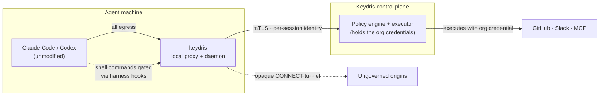

<div align="center">

# 🗝️ Keydris CLI

**Secretless, governed egress for AI coding agents.**

Give an *unmodified* agent — Claude Code, OpenAI Codex — a fresh cryptographic
identity per session, route all of its network traffic through a policy-aware
local proxy, and keep real credentials off the agent's machine entirely.

[](https://github.com/keydrisLabs/keydris-cli/actions/workflows/ci.yml)
[](https://github.com/keydrisLabs/keydris-cli/actions/workflows/release.yml)
[](https://codecov.io/gh/keydrisLabs/keydris-cli)
[](https://goreportcard.com/report/github.com/keydrisLabs/keydris-cli)

[](https://pkg.go.dev/github.com/keydrisLabs/keydris-cli)
[](https://www.npmjs.com/package/@keydris/cli)
[](go.mod)
[](LICENSE)

[**Documentation**](https://docs.keydris.com) ·
[**Quickstart**](#-quickstart-claude-code) ·
[**Commands**](#-command-reference) ·
[**Contributing**](CONTRIBUTING.md)

</div>

---

## The problem

AI coding agents need credentials — a GitHub PAT, a Slack bot token, MCP server
keys. The moment you hand one to the agent, the secret lives on the agent's
machine, appears in its environment, and can be exfiltrated by a single
prompt-injected `curl`.

**Keydris removes the secret from the equation.** The agent talks to a local
proxy; the proxy authorizes every request against the agent's organization
policy; and for governed origins the Keydris control plane *executes the call
itself* with the real credential and relays back the response. The agent gets
its `200 OK` without ever holding a token.

## ✨ Highlights

- 🔑 **Per-session identity** — every agent session mints a fresh, short-lived
  SPIFFE identity (JWT-SVID) over mTLS. Sessions are registered on start and
  revoked on exit; concurrent sessions on one machine stay fully attributed.
- 🕵️ **Secretless by design** — governed calls (GitHub, Slack, MCP) are
  executed by the control plane; the agent machine never sees the org
  credential. The private key from `keydris login` never leaves your device.
- 🛂 **Command gating, fail-closed** — every shell command the agent runs is
  checked against the policy's command rules (`allow` / `require_approval` /
  `reject`) before it executes. Any error path is an explicit deny — never a
  silent allow.
- 🎛️ **Zero hand-configuration** — `keydris init` detects which origins the
  agent's policy governs and persists them as the proxy scope. Every session
  start refreshes it, so a policy change lands without a re-init.
- 📜 **Tamper-evident audit** — a hash-chained evidence ledger records every
  decision; `keydris logs` prints and cryptographically verifies the chain.
- 🧩 **Unmodified agents** — integrates through Claude Code's and Codex's
  native hook systems. No forks, no patched binaries, no custom harness.
- 📦 **One static binary** — pure Go, a single third-party dependency,
  `CGO_ENABLED=0`. Install via shell script, npm, or `go install`.

## 🧠 How it works



At session start, a hook mints a **runtime session** over mTLS and receives a
**KIT** — a short-lived SPIFFE JWT-SVID. The daemon then fetches the session's
**routes**: the origins the agent's policy governs, each tagged with an
enforcement mode and the specific resources (repos, channels, tools) selected
for that agent. Every proxied request is matched against those routes before
anything reaches the network:

| Enforcement mode | What happens |
| --- | --- |
| `provider_executor` | The request (GitHub, Slack) is relayed to the control plane's executor with the stable resource id resolved from the request — GitHub `owner/repo` from the path, Slack `channel` from the body. The control plane authorizes and executes upstream with the org credential; the agent never holds it. |
| `mcp_gateway` | JSON-RPC `tools/call` / `resources/read` calls are relayed through the control plane's MCP gateway. |
| `mcp_kit_reader` | MCP lifecycle and discovery traffic passes through unchanged. For `tools/call` / `resources/read`, the daemon mints a short-lived, action-bound token and injects it at `params._meta["keydris/kit_action_token"]`, forwarding directly to the managed MCP server. |
| *(origin not governed by any route)* | Falls back to the broker path and the detected proxy-scope rules. |

Every client-side decision is re-enforced server-side at execution time.
Repeated session starts for one logical session (compaction, resume, a Codex
retry) revoke the previous instance first; session end revokes on exit.

<details>
<summary><b>Data planes</b> — three ship in the binary; the default needs no configuration</summary>
<br/>

| Plane | Platform | Mechanism |
| --- | --- | --- |
| `sandbox` *(default)* | cross-platform | TLS-terminating forward proxy that Claude Code's sandbox routes all Bash-subprocess egress to. No root, no iptables. See [docs/sandbox.md](docs/sandbox.md). |
| `transparent` | Linux + root | iptables `REDIRECT` + `SO_ORIGINAL_DST`; optional race-free eBPF attribution behind the `ebpf` build tag. See [docs/attribution.md](docs/attribution.md). |
| `proxyenv` | cross-platform | Kernel-free `HTTP_PROXY` fallback. Bypassable by design; token-attributed only. |

Override only when needed, via `KEYDRIS_DATAPLANE`.

</details>

## 📦 Installation

**Shell script** (macOS, Linux) — downloads a prebuilt static binary, verifies
its SHA-256 checksum, and installs to `/usr/local/bin`:

```bash
curl -fsSL https://get.keydris.com/keydris-cli/install.sh | bash
```

**npm** (macOS, Linux, Windows) — requires Node ≥ 20; a global install is
recommended because the proxy runs in the background:

```bash
npm install --global @keydris/cli
```

The npm package selects a prebuilt native binary for your platform — it does
not replace the security-sensitive Go runtime with JavaScript. See
[docs/npm-distribution.md](docs/npm-distribution.md).

**From source** — requires Go ≥ 1.22:

```bash
make install                                                # to /usr/local/bin
go install github.com/keydrisLabs/keydris-cli/cmd/keydris@latest
```

On Windows, use npm or build natively: `go build -o bin\keydris.exe .\cmd\keydris`

Once installed, `keydris upgrade` replaces the binary in place with the latest
checksum-verified release, and `keydris version` reports the installed build.

## 🚀 Quickstart (Claude Code)

You need a reachable control plane and an **agent id** — a UUID an operator
creates in the [Keydris console](https://docs.keydris.com), where the governing
policy is assigned. The CLI never selects or overrides a policy.

```bash
# 1. Sign in and configure Claude Code: generates the Keydris CA, writes the
#    sandbox block + hooks into ~/.claude/settings.json, binds this device to
#    the agent via browser sign-in, and detects the policy's governed origins.
keydris init claude-code <agent-id>     # --trust-store installs the CA system-wide

# 2. Start the brokered egress proxy (backgrounds itself — no `&` needed).
keydris proxy up

# 3. Confirm enforcement state and the detected proxy scope.
keydris status

# 4. Run a real session. Claude Code fires the wired hooks: a fresh identity
#    is minted, egress is brokered and secretless, and every shell command is
#    checked against the policy's command rules.
claude
```

Running `keydris init` with no arguments opens an interactive setup menu with
the same choices. `keydris login` also works standalone (e.g. to
re-authenticate); `init` runs it automatically when needed.

## 🚀 Quickstart (OpenAI Codex)

Codex doesn't expose a reliable end-of-session hook, so Keydris owns the
lifecycle by wrapping the process:

```bash
keydris init codex <agent-id>        # `init openai` is also accepted
keydris proxy up
keydris codex                        # pass normal Codex arguments after this
```

The wrapper enables Codex's sandboxed network proxy, chains it through
Keydris, mints one session before Codex starts, and revokes it when Codex
exits. Launch Codex through `keydris codex` — not directly — when governance
is required. See [docs/codex.md](docs/codex.md).

**Any other process** can run inside a governed session too:

```bash
keydris run -- curl -s https://your-api/
keydris run -- claude    # also covers Claude Code's native remote-HTTP MCP client
```

## 🛂 Command gating

A policy can carry **command rules** — glob patterns over the full shell
command line (`git push*` also matches `git push --force`) — with `allow`,
`require_approval`, or `reject` effects. Each command the agent wants to run
is authorized against the control plane and mapped to the harness's own
permission verdict:

- **Claude Code** — `init` wires a `PreToolUse` hook (matcher `Bash`;
  `Bash|PowerShell` on Windows) into `~/.claude/settings.json`.
- **Codex** — `init` writes `~/.codex/hooks.json` with a deny-only
  `PreToolUse` hook plus a `PermissionRequest` hook that auto-allows
  policy-allowed commands and stays silent otherwise, so approval-required
  commands land on Codex's interactive prompt. Pair it with
  `approval_policy = "untrusted"` and run `/hooks` once inside Codex to trust
  the entries.

**Fail-closed:** no active session, an unreachable control plane, a timeout, a
malformed payload — every error path produces an explicit deny.
`keydris status` reports whether the hooks are wired; `keydris deinit` removes
them cleanly, preserving your unrelated settings.

## 🧭 Command reference

| Command | Description |
| --- | --- |
| `keydris login` | Browser sign-in (OAuth 2.0 + PKCE); stores a local client certificate. `--email`, `--no-browser` |
| `keydris whoami` | Show the locally stored identity and certificate expiry |
| `keydris logout` | Remove the locally stored identity |
| `keydris init` | Interactive agent setup |
| `keydris init claude-code <agent>` | Configure Claude Code sandbox + CA + hooks. `--strict`, `--trust-store` |
| `keydris init codex <agent>` | Configure OpenAI Codex hooks + CA. `--trust-store` |
| `keydris deinit claude-code\|codex` | Undo init: remove the Keydris config, keep everything else |
| `keydris proxy up` | Start the brokered egress proxy in the background |
| `keydris proxy down` | Stop the background proxy |
| `keydris proxy scope list` | Show the origins detected from the agent's policy |
| `keydris run -- <cmd...>` | Run any command inside a governed session |
| `keydris codex [args...]` | Run OpenAI Codex inside a governed session |
| `keydris status` | Show config, identity, proxy, and enforcement state |
| `keydris logs` | Print and verify the hash-chained evidence ledger |
| `keydris upgrade` | Replace the binary with the latest verified release. `--channel`, `--version`, `--no-config` |
| `keydris version` | Print the version |
| `keydris help` | Show usage |

`<agent>` is the agent id (a UUID) created for the integration in the Keydris
console; the policy that governs it is assigned there, not on the command line.

## ⚙️ Configuration

The CLI talks to a **Keydris control plane** over mTLS. Point at yours through
the process environment or the trusted user-level `~/.keydris.toml` (see
[.keydris.toml.example](.keydris.toml.example)):

```bash
export KEYDRIS_CONTROL_URL=https://api.keydris.com                # identity + JWKS
export KEYDRIS_CONTROL_MTLS_URL=https://api.keydris.com:8443      # mTLS authorization
```

Precedence: **process environment → `~/.keydris.toml` → built-in defaults**.

> [!NOTE]
> Project-local `.env` and `.keydris.toml` files are **ignored by default**:
> a cloned repository must not be able to redirect your OAuth, identity, or
> control-plane endpoints. Opt in explicitly with
> `KEYDRIS_TRUST_PROJECT_CONFIG=1` if you need per-project configuration.

<details>
<summary><b>Commonly used environment variables</b></summary>
<br/>

| Variable | Default | Purpose |
| --- | --- | --- |
| `KEYDRIS_CONTROL_URL` | `http://127.0.0.1:8081` | Control-plane base URL (identity, JWKS) |
| `KEYDRIS_CONTROL_MTLS_URL` | `https://127.0.0.1:8443` | Control-plane mTLS URL (authorization) |
| `KEYDRIS_PROXY_PORT` | `15001` | Local proxy listen port |
| `KEYDRIS_DATAPLANE` | `sandbox` | Data plane: `sandbox` \| `transparent` \| `proxyenv` |
| `KEYDRIS_DATA_DIR` | `~/.keydris-data` | CA, identity, ledger, and session state (0700) |
| `KEYDRIS_CLAUDE_SETTINGS` | `~/.claude/settings.json` | Claude Code settings file written by `init` |
| `KEYDRIS_CODEX_HOOKS` | `~/.codex/hooks.json` | Codex hooks file written by `init` |
| `KEYDRIS_TRUST_PROJECT_CONFIG` | *(unset)* | Set to `1` to honor project-local config files |

The full reference — OAuth/OIDC settings, TLS knobs, data-plane tuning — lives
at [docs.keydris.com](https://docs.keydris.com).

</details>

## 🛠️ Development

Requires **Go ≥ 1.22** (and **Node ≥ 20** only for the npm packaging checks).

```bash
make build        # → ./bin/keydris
make test         # go test ./...
make vet          # go vet ./...
go test -race -cover ./...          # what CI runs
cd npm && npm test                  # npm packaging verification
```

Project layout:

```text
cmd/keydris/        entry point (delegates to internal/cli)
internal/cli/       command dispatch, init/login/proxy/run/status/logs
internal/node/      proxy data planes, daemon, session attribution
internal/evidence/  hash-chained audit ledger
internal/config/    env + TOML configuration, trust boundaries
docs/               design docs (sandbox, attribution, codex, npm)
npm/                npm distribution packages and checks
deploy/             systemd unit and channel configs
```

Static release builds are stdlib-only (a single third-party dependency for
JSON canonicalization) with `CGO_ENABLED=0 -trimpath`. An optional eBPF
attribution path builds behind `-tags ebpf` on Linux (`make ebpf-build`).

See [CONTRIBUTING.md](CONTRIBUTING.md) for the full development guide.

## 📚 Documentation

Full documentation lives at **[docs.keydris.com](https://docs.keydris.com)**.
Design deep-dives are in-repo:

- [docs/sandbox.md](docs/sandbox.md) — Claude Code sandbox integration and trust model
- [docs/attribution.md](docs/attribution.md) — session attribution across the data planes
- [docs/codex.md](docs/codex.md) — the Codex wrapper and command gating
- [docs/npm-distribution.md](docs/npm-distribution.md) — how the npm packages are built and verified

## 🤝 Contributing

Contributions are welcome! Please read the
[Contributing Guide](CONTRIBUTING.md) for the development workflow and the
[Code of Conduct](CODE_OF_CONDUCT.md) that governs this project. Security
issues should follow the [security policy](SECURITY.md) — please don't open
public issues for vulnerabilities.

## 🔒 Security

The security model, the guarantees each data plane provides, and how to
privately report a vulnerability are documented in [SECURITY.md](SECURITY.md) —
read it before relying on Keydris in an adversarial setting. Two properties
worth restating:

- Un-bypassability of the `sandbox` plane comes from the harness sandbox
  routing all egress to the proxy; the `proxyenv` plane is advisory by design.
- `keydris logs` and `proxy.log` include full JSON tool parameters for managed
  authorization calls. They are written owner-only, but may contain
  application secrets and must be handled accordingly.

## 📄 License

Copyright © 2026 Keydris, Inc.

Licensed under the [Apache License, Version 2.0](LICENSE).

---

<div align="center">
<sub>Built with ❤️ by <a href="https://keydris.com">Keydris</a> — governed egress for the agentic era.</sub>
</div>
