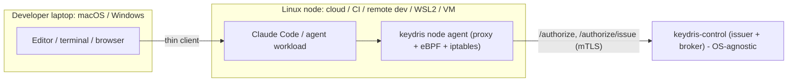

# Distribution & Platform Support

How Keydris reaches users on Linux, Windows, and macOS. This is the install/
onboarding companion to the architecture in [plan.md](../plan.md) section 7,
which is the source of truth for the cross-platform data-plane design.

> **v2 update.** The recommended cross-platform path is now the Claude Code
> sandbox proxy (`KEYDRIS_DATAPLANE=sandbox`), which delivers non-bypassable,
> kernel-enforced egress on macOS, Linux, and WSL2 with no drivers or
> entitlements. See [sandbox.md](sandbox.md) and [plan_v1.md](../plan_v1.md).
> The native data planes below are demoted to the optional "any-runtime / kernel
> tier" for non-Claude-Code agents.

## TL;DR

- The **control plane** (`keydris-control`: issuer + broker), the SPIFFE scheme,
  the CLI, the Claude Code hooks, and the evidence ledger are portable Go and
  behave identically on every OS.
- Only the **data plane** (interception + per-connection attribution) is
  OS-specific. It is confined behind one interface, `DataPlane`, in
  [internal/dataplane](../internal/dataplane).
- The POC ships the **Linux** native plane plus a portable **proxy-env**
  fallback; macOS (`NETransparentProxyProvider`) and Windows (WinDivert) native
  planes are post-POC implementations of the same interface.
- The right question is not "which OS is the laptop?" but **"where does the agent
  workload run?"** — and agents overwhelmingly run on Linux.

## The seam: one interface, many planes

All platform code lives behind `DataPlane` (see
[internal/dataplane/dataplane.go](../internal/dataplane/dataplane.go)); everything
downstream (broker authorize, credential injection, evidence) is shared:

```go
type DataPlane interface {
    Flows() <-chan Flow              // one event per intercepted outbound connection
    Inject(f Flow, c Credential) error
    Reject(f Flow, reason string) error
    Close() error
}
```

Interception and attribution differ per OS; everything else is identical.

## Why the data plane is Linux-first

The Linux native plane relies on Linux kernel facilities with no portable
equivalent — so other OSes need their own native planes rather than a port:

- **netfilter / iptables** — transparent redirection (`REDIRECT --to-ports`) is a
  Linux kernel feature. macOS uses Network Extension; Windows uses WFP/WinDivert.
- **`SO_ORIGINAL_DST`** — recovering a redirected connection's original
  destination relies on Linux conntrack (`getsockopt(SOL_IP, SO_ORIGINAL_DST)`).
  See [internal/dataplane/transparent_linux.go](../internal/dataplane/transparent_linux.go)
  (and the `!linux` stub in
  [transparent_other.go](../internal/dataplane/transparent_other.go)).
- **eBPF + cgroups** (Phase 2+) — CO-RE eBPF keyed by cgroup id, requiring kernel
  BTF (`/sys/kernel/btf/vmlinux`). macOS/Windows have no eBPF or cgroups.

Notably, the difficulty *inverts* off Linux: macOS and Windows hand you the
originating process per flow for free (no eBPF needed), so the hard part there is
not attribution but **platform trust** — Apple's entitlement + notarization, or
Windows driver signing. Session binding uses **PID ancestry** instead of cgroups.

## Deployment topology



The laptop is a thin client; the workload that holds credentials and needs
brokered, attested egress lives on the Linux node, next to keydris.

## Where agents actually run

The strong guarantees matter most exactly where agents already run on Linux:

- Cloud agent runtimes / hosted sessions
- CI/CD pipelines (Linux runners)
- Remote dev environments (Codespaces, Coder, Gitpod, devcontainers, SSH)
- Servers and containers

## Tiered rollout

Mirrors the rollout table in [plan.md](../plan.md) section 7:

| Tier | Platforms | Transparency | When |
|------|-----------|--------------|------|
| WSL2 / Linux devcontainer | macOS, Windows (devs) | full Pattern 3 (the Linux agent runs unchanged inside) | now — zero new code |
| Proxy-env fallback (Pattern 2) | macOS, Windows, Linux | through a configured proxy; bypassable | now — `internal/dataplane/proxyenv.go` |
| Native data plane | Linux (eBPF) -> macOS (NE) -> Windows (WFP) | full Pattern 3, non-bypassable | Linux in this POC; NE + WFP post-POC |

For macOS dev specifically, keydris can manage a Linux VM (Lima / Apple
Virtualization.framework / OrbStack-style) so the user never thinks about it
(`keydris vm up`, then `keydris run -- claude` execs into the VM with the
workspace mounted) — the same trick Docker Desktop and OrbStack use.

## Proxy-env fallback (laptop-host execution)

When an agent must run on the laptop host OS directly (no VM/WSL2), kernel-level
transparent interception is impossible, but egress can still be brokered via the
proxy-env plane ([internal/dataplane/proxyenv.go](../internal/dataplane/proxyenv.go),
selected with `KEYDRIS_DATAPLANE=proxyenv`). The cross-platform Claude Code
SessionStart hook mints the identity and sets `HTTP_PROXY`/`HTTPS_PROXY` to the
local keydris proxy, which injects the credential.

Tradeoffs (a deliberate downgrade):

- Not transparent — an agent could unset the proxy env var.
- No per-connection PID attribution.
- Plaintext HTTP only in the POC; HTTPS CONNECT/MITM is a stretch item.

## Native macOS / Windows planes (post-POC)

These are planned implementations of the same `DataPlane` interface, not native
ports of the Linux mechanism:

- **macOS**: a `NETransparentProxyProvider` system extension delivers per-flow
  interception; `NEFlowMetaData` (signing id / audit token) supplies attribution.
  Cost: an Apple Network Extension entitlement, code-signing + notarization, and
  user approval — built as a signed/notarized `.app` system extension bridged
  from the Go daemon.
- **Windows**: WinDivert (userspace, over WFP) ships its own signed driver, so we
  avoid shipping a kernel driver in the POC; attribution comes from the WinDivert
  SOCKET layer / WFP connect layer (`GetExtendedTcpTable`), with a Job Object
  firming up the session boundary.

The main cost off Linux is platform trust (Apple entitlement lead time, Windows
driver signing), not attribution.

## Recommendation

- **POC**: one supported path — run the demo on Linux (native, a Lima/multipass
  VM on macOS, or WSL2 on Windows). The proxy-env plane exists for portability.
- **Product**:
  - Primary: Linux hosts (cloud / CI / remote dev).
  - Windows: WSL2 now; native WinDivert plane later.
  - macOS: a keydris-managed Linux VM now; native NE plane later.
  - Proxy-env mode: an explicit, clearly-labeled fallback for laptop-host
    execution.
